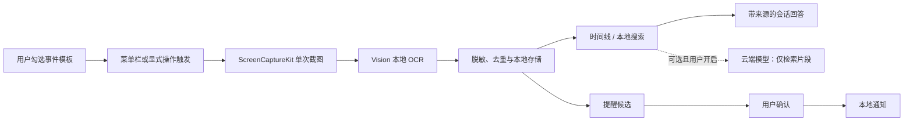

# Recall

> **本地优先、可追溯的 macOS 个人记忆应用。**

Recall 将用户显式触发的工作节点转成可搜索的本地记忆。它可以按用户选择的事件模板截取当前窗口或显示器、使用 macOS Vision 在本机提取文字、保存可删除的时间线，并基于检索到的证据回答问题或提出待确认的提醒候选。它的目标不是记录一切，而是帮助用户保存真正重要的上下文。

## 核心原则

Recall 的默认行为是 **本地优先、明确触发、可追溯、可删除**。它不会默认监听裸 Enter，不会默认连续截图，也不会默认把截图或完整历史发送到云端。每条回答关联本地记忆来源；每个提醒都必须由用户确认后才能创建。

## 已实现功能

| 能力 | 当前实现 |
|---|---|
| 事件模板 | 提供 8 个可独立启用、配置和关闭的记录模板，包括手动记录、工作节点、网页研究、会议、待办、文档里程碑、任务切换和每日回顾。 |
| 显式采集 | 使用菜单栏入口与“记录此刻”窗口触发；支持当前窗口、当前显示器与仅文本三种范围。 |
| 本地 OCR | 通过 `Vision` 的 `VNRecognizeTextRequest` 在设备端提取中文和英文文本。 |
| 本地记忆 | 将时间、来源应用、OCR、摘要、标签和可选截图保存在 `~/Library/Application Support/Recall/`。 |
| 搜索与问答 | 提供时间线搜索和检索增强会话；本地模式不会进行网络请求。 |
| 模型接入 | 提供 OpenAI 兼容接口；API Key 只保存于 macOS Keychain，云端模式必须在界面中明确开启。 |
| 提醒 | 从待办/承诺类文本提出提醒候选，用户确认且授权通知后才会创建本地通知。 |
| 隐私控制 | 支持暂停采集、截图开关、应用 Bundle ID 排除列表、基本敏感信息脱敏与记录删除。 |

## 信息流



## 快速开始

Recall 是一个原生 Swift Package 项目，要求 **macOS 14 或更高版本**。日常开发建议安装完整 Xcode；仅构建核心与运行验证器时可使用最新版 Xcode Command Line Tools。

```bash
git clone https://github.com/your-org/recall.git
cd recall
swift build --jobs 1
swift run RecallApp
```

首次记录截图前，请在 **系统设置 → 隐私与安全性 → 屏幕与系统音频录制** 中允许 Recall。应用只有在用户点击“记录此刻”或启用的特定事件触发时才请求屏幕内容。

> 在本仓库当前开发环境中，完整 Xcode 尚未安装，因此使用 `swift build` 和 `swift run RecallVerifier` 验证核心逻辑。安装完整 Xcode 后，可直接打开 `Package.swift` 进行界面调试、签名与发布。

## 验证

项目提供无网络、无真实截图、无真实云端密钥的集成验证器。它覆盖事件规则、隐私脱敏、应用排除、模拟截图到 OCR 的记录管线、重复记录拦截、检索排序、提醒去重、本地持久化和可追溯回答。

```bash
swift build --jobs 1
swift run RecallVerifier
```

成功输出如下：

```text
PASS: RecallVerifier completed 7 integration checks.
```

## 事件模板

| 模板 | 默认状态 | 说明 |
|---|---:|---|
| 手动记录此刻 | 启用 | 从菜单栏或“记录此刻”窗口保存当前工作节点。 |
| 当前窗口工作节点 | 启用 | 适合在白名单应用内以组合快捷键创建阶段性记录。 |
| 网页研究摘录 | 关闭 | 用于用户主动保存网页研究材料。 |
| 会议开始与结束 | 关闭 | 用明确操作建立会议相关记录；不录音、不后台持续截屏。 |
| 待办或承诺创建 | 启用 | 保存用户确认的待办，允许提出提醒候选。 |
| 文件或文档里程碑 | 关闭 | 保存文档、设计稿或代码的阶段性上下文。 |
| 任务切换复盘 | 关闭 | 在任务切换时记录用户主动填写的复盘。 |
| 定时个人回顾 | 启用 | 汇总已有显式记录；不会在定时点额外截图。 |

## 隐私与模型

本地 OCR、搜索、摘要回退、提醒候选与数据持久化均可离线运行。截图文件和 JSON 状态默认位于 `~/Library/Application Support/Recall/`。模型 API Key 使用 Keychain 保存；它不会写进 JSON、日志或 Git 仓库。

如果用户在“隐私与模型”中切换到兼容 OpenAI 的云端模型，Recall 仍只会将**与当前问题相关的、经过基础脱敏的 OCR 文本片段**发送到用户配置的服务端。云端模式未启用或未配置密钥时，会话会回退到本地可追溯摘要。详见 [隐私设计](docs/PRIVACY.md)。

## 项目结构

```text
Sources/
  RecallApp/       SwiftUI 应用、菜单栏入口、时间线、会话与设置界面
  RecallKit/       采集、OCR、隐私、记忆、会话、提醒与持久化核心
Verification/      无外部依赖的集成验证器
docs/              架构、隐私与贡献说明
.github/workflows/ CI 配置
```

## 贡献与路线图

欢迎提交 issue 和 pull request。提交前请阅读 [贡献指南](CONTRIBUTING.md) 与 [安全政策](SECURITY.md)，并运行验证命令。当前版本是一个隐私优先的 MVP；下一阶段将加入真正的全局组合快捷键注册、SQLite/向量检索、端到端加密同步、更精细的敏感页面排除和无障碍审计。

项目以 [MIT License](LICENSE) 发布。
