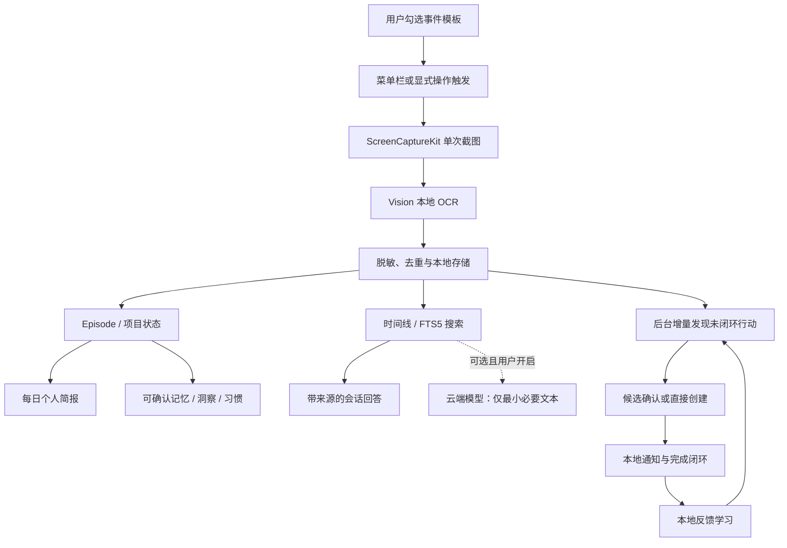

# Recall

> **本地优先、可校正、越用越懂你的 macOS 个人智能助手。**

Recall 将用户显式触发的工作节点转成可搜索、可学习的本地记忆。除了时间线，它会把零散记录归并为工作 Episode、持续维护项目状态、在后台发现未闭环行动，并在合适的时间把真正需要处理的事情重新带回注意力。每日简报优先展示真实进展、未闭环事项、少量高价值洞察和下一步行动。它的目标不是记录一切，而是在用户可见、可纠正、可删除的前提下逐渐理解什么对用户真正重要。

## 核心原则

Recall 的默认行为是 **本地优先、明确触发、可追溯、可删除**。它不会默认监听裸 Enter，不会默认连续截图，也不会默认把截图或完整历史发送到云端。用户可在“记录事件”中明确启用 Enter 键触发记录；该规则默认关闭、可随时暂停，且仅在 Recall 不在前台时响应。每条回答关联本地记忆来源；每个提醒都必须由用户确认后才能创建。

## 已实现功能

| 能力 | 当前实现 |
|---|---|
| 事件模板 | 提供 9 个可独立启用、配置和关闭的记录模板，包括手动记录、工作节点、网页研究、会议、待办、文档里程碑、任务切换、每日回顾和默认关闭的 Enter 键触发记录。 |
| 显式采集 | 使用菜单栏入口与“记录此刻”窗口触发；支持当前窗口、当前显示器与仅文本三种范围。 |
| 本地 OCR | 通过 `Vision` 的 `VNRecognizeTextRequest` 在设备端提取中文和英文文本。 |
| 本地记忆 | 将时间、来源应用、OCR、摘要、标签和可选截图保存在 `~/Library/Application Support/Recall/`。 |
| 搜索与问答 | 提供时间线搜索和检索增强会话；长对话采用滚动摘要、最近消息窗口和独立记忆证据三层上下文管理。 |
| 个人简报 | 每日总结不再复述时间线，而是输出主线、真实进展、未闭环事项、最多 3 条洞察和下一步行动，并兼顾全天覆盖与高重要度事件。 |
| 项目与工作 Episode | 将相近时间、同一项目的记录聚合为工作 Episode，持续维护项目阶段、成果、阻塞和开放事项。 |
| 可校正的长期记忆 | 仅把明确表达的目标、偏好、约束、习惯和工作流作为候选；用户确认后才进入长期记忆，拒绝后不再采用。 |
| 反馈学习 | 洞察支持“准确 / 部分准确 / 不准确”；连续负反馈会抑制同类洞察。重复出现的工作模式只作为候选，用户启用后才影响建议。 |
| 本地智能索引 | JSON 保持兼容数据源，同时用 SQLite WAL + FTS5 建立可重建的本地搜索与智能状态索引。 |
| 模型接入 | 提供可编辑的 OpenAI 与 Anthropic 兼容接口；地址、模型、API Key 均可配置，密钥作为普通文本仅保存于用户本机 Recall 配置。 |
| 智能提醒 | 后台增量分析用户允许参与的本地记忆，过滤疑问、完成态、代码与界面噪声，识别待办、承诺、截止时间与重复周期；支持直接创建、确认候选、稍后提醒、修改、完成、取消、来源追溯和通知快捷操作。 |
| 隐私控制 | 支持暂停采集、截图开关、应用 Bundle ID 排除列表、基本敏感信息脱敏与记录删除。 |

## 信息流



## 智能提醒：让记忆在正确的时间重新出现

提醒不是把所有文字都变成任务，而是从已有记忆中找出**值得再次进入注意力的未闭环行动**。Recall 默认在启动、新记录写入、规则改变以及前台运行期间定时做增量分析；内容未变化的记录由哈希检查点跳过，因此数据增长后不会每次重新扫描全部历史。

- **更精确的发现**：只有用户允许参与提醒的事件类型会被分析；每日总结不会再作为输入重复产生候选。规则会过滤疑问句、已完成事项、日志、代码注释、导航菜单和过短标签，并合并同一事项的多条来源。
- **时间与周期**：支持今天、明天、后天、星期、月底、明确日期、几分钟/小时/天后，以及中文上午/下午/半点等时间；可设置不重复、每天、每周或每月。
- **完整闭环**：候选由用户确认时间后才进入系统通知；也可以直接新建。已安排提醒支持修改、稍后、完成和取消，通知横幅可直接“完成”“1 小时后提醒”或“明天提醒”。点击通知会前置 Recall 并打开提醒页。
- **越用越贴合**：确认、忽略、完成和稍后操作只在本地形成反馈。重复忽略会降低同类弱候选的置信度；常用的确认/稍后时段会成为新提醒的默认时间。被忽略的候选 30 天内不会反复出现，新的发生日期仍可重新发现。
- **可控且可删除**：后台发现只读取已经保存的文本，不主动截图、不调用云端模型，也不会自动创建通知。删除来源记录会一并删除其派生提醒；手动提醒不受影响。提醒历史按页展示，过旧的完成/取消记录会自动清理，状态上限用于避免长期运行后无限增长。

默认页围绕用户当前最需要做的事组织：顶部显示“已过期 / 今天 / 接下来 / 待确认”，正文优先展示已安排事项，其次是待确认候选和历史，而不是展示内部处理流程。没有候选时会说明实际参与分析的记忆数量，并保留“新建提醒”和“重新分析”两个明确入口。

## 快速开始

Recall 是一个原生 Swift Package 项目，要求 **macOS 14 或更高版本**。日常开发建议安装完整 Xcode；仅构建核心与运行验证器时可使用最新版 Xcode Command Line Tools。

```bash
git clone https://github.com/samz406/Recall.git
cd recall
swift build --jobs 1
./scripts/run-app.sh
```

首次记录截图前，请在 **系统设置 → 隐私与安全性 → 屏幕与系统音频录制** 中允许 Recall。应用只有在用户点击“记录此刻”或启用的特定事件触发时才请求屏幕内容。创建首个提醒时，macOS 会在用户主动点击“创建提醒”后请求通知授权；请使用 `./scripts/run-app.sh` 启动，因为本地通知需要带 Bundle 标识的 `Recall.app`，而不能直接运行原始 SwiftPM 可执行文件。

> 在本仓库当前开发环境中，完整 Xcode 尚未安装，因此使用 `swift build` 和 `swift run RecallVerifier` 验证核心逻辑。`scripts/run-app.sh` 会把当前构建包装成开发用 `Recall.app` 并启动它。安装完整 Xcode 后，可直接打开 `Package.swift` 进行界面调试、签名与发布。

## 验证

项目提供无网络、无真实截图、无真实云端密钥的集成验证器。它覆盖事件规则、隐私脱敏、应用排除、模拟截图到 OCR 的记录管线、重复记录拦截、检索排序、提醒精度与去重、相对/中文时间、重复周期、完成与忽略生命周期、本地反馈学习、来源删除联动、扫描检查点、通知宿主保护、本地持久化、自定义模型连接配置、长对话压缩、可追溯回答、Episode 聚合、重要记录选择、洞察反馈、习惯学习、SQLite FTS5 与旧状态迁移。另提供可选的真实 Anthropic 兼容服务探测。

```bash
swift build --jobs 1
swift run RecallVerifier
```

成功输出如下：

```text
PASS: RecallVerifier completed 28 integration checks.
```

## 事件模板

| 模板 | 默认状态 | 说明 |
|---|---:|---|
| 手动记录此刻 | 启用 | 从菜单栏或“记录此刻”窗口保存当前工作节点；默认参与提醒发现。 |
| 当前窗口工作节点 | 启用 | 适合在白名单应用内以组合快捷键创建阶段性记录；默认参与提醒发现。 |
| 网页研究摘录 | 关闭 | 用于用户主动保存网页研究材料。 |
| 会议开始与结束 | 关闭 | 用明确操作建立会议相关记录；不录音、不后台持续截屏；启用后参与提醒发现。 |
| 待办或承诺创建 | 启用 | 保存用户确认的待办，允许提出提醒候选。 |
| 文件或文档里程碑 | 关闭 | 保存文档、设计稿或代码的阶段性上下文；启用后参与提醒发现。 |
| 任务切换复盘 | 关闭 | 在任务切换时记录用户主动填写的复盘；启用后参与提醒发现。 |
| 定时个人回顾 | 启用 | 汇总已有显式记录；不会在定时点额外截图，也不会被再次扫描为提醒。 |
| Enter 键触发记录 | 关闭 | 由用户明确启用后，在 Recall 不在前台时监听 Enter 并记录当前窗口；可随时暂停。 |

## 隐私与模型

本地 OCR、搜索、摘要回退、提醒候选与数据持久化均可离线运行。截图文件、JSON 状态和模型 API Key 默认位于 `~/Library/Application Support/Recall/`。API Key 作为本机普通文本配置保存；它不会写入日志或 Git 仓库。

用户可在“隐私与模型”中选择**兼容 OpenAI API**或**兼容 Anthropic API**，并自行编辑地址、模型名称与 API Key。云端模式仍只会发送当前问题、经过基础脱敏的检索证据、压缩摘要和最近会话窗口；云端模式未启用或未配置密钥时，会话会回退到本地可追溯摘要。详见 [隐私设计](docs/PRIVACY.md)。

## 项目结构

```text
Sources/
  RecallApp/       SwiftUI 应用、菜单栏入口、时间线、会话与设置界面
  RecallKit/       采集、OCR、隐私、记忆、会话、提醒与持久化核心
Verification/      无外部依赖的集成验证器
docs/              架构、隐私与贡献说明
.github/workflows/ CI 配置
```

## 贡献与路线图

欢迎提交 issue 和 pull request。提交前请阅读 [贡献指南](CONTRIBUTING.md)、[个人智能设计](docs/PERSONAL_INTELLIGENCE.md) 与 [安全政策](SECURITY.md)，并运行验证命令。后续重点包括真正的全局组合快捷键注册、可选向量检索、端到端加密同步、更精细的敏感页面排除和无障碍审计。

项目以 [MIT License](LICENSE) 发布。
