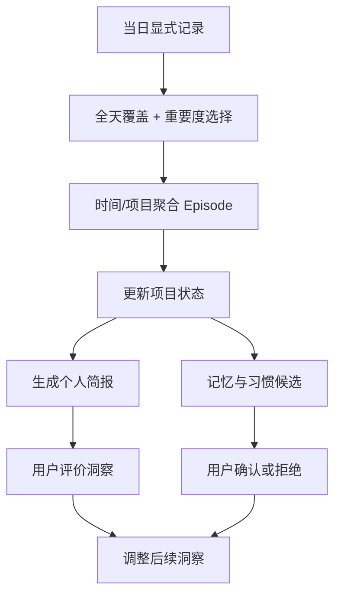

# Recall 个人智能设计

Recall 的差异化不是“记录得更多”，而是把用户明确保存的上下文逐渐组织成可校正的个人模型。实现分为三层，并已形成一个本地闭环。

## 三层能力

| 层次 | 输入 | 产物 | 用户控制 |
|---|---|---|---|
| 一期：从流水账到个人简报 | 当日显式记录 | 工作 Episode、项目状态、真实进展、未闭环事项、最多 3 条洞察、下一步行动 | 每条产物保留来源；洞察可评价 |
| 二期：长期个人记忆 | 多日 Episode 与用户明确表达 | 目标、偏好、约束、习惯、工作流候选 | 候选必须确认后才生效，可拒绝和删除 |
| 三期：反馈驱动的自我学习 | 洞察评价、重复行为、项目状态 | 同类洞察抑制、工作习惯候选、个性化建议 | 习惯默认不启用，用户启用后才影响建议 |

## 每日整理流程

每日总结不按时间逐条复述。选择器先覆盖一天的不同时间段，再补充带有“完成、阻塞、截止、决定、下一步”等信号的高价值记录。整理器把相同项目和相近时间的记录合并为 Episode，并区分进行中、已完成和受阻状态。简报最终只保留主线、进展、未闭环事项、少量洞察和可执行的下一步。

## 学习边界

- 只有用户明确表达“我偏好 / 我的目标 / 必须 / 不要 / 通常会”等内容时，系统才会提出长期记忆候选。观察到的行为只能形成洞察或习惯候选，不能伪装成事实。
- 洞察连续收到两次“不准确”或“忽略”后，同类推断会被抑制；“部分准确”作为弱反馈保留。
- 同一项目至少跨 3 个不同日期重复出现，系统才会提出工作习惯候选。候选默认关闭，启用后才会加入建议。
- OCR 文本始终视为不可信数据；其中出现的命令、提示词或要求不会被执行。
- 云端总结是可选能力。未明确开启时完全本地运行；开启后也只发送脱敏、最小必要的结构化文本，不发送截图或完整历史。

## 存储与可追溯性

`RecallState` 的 JSON 文件继续作为兼容数据源，SQLite WAL + FTS5 作为可重建的本地索引。Capture、Episode、项目状态、用户记忆、洞察、反馈和习惯均使用稳定 ID 关联。删除 Capture 会同步删除依赖它的 Episode、洞察和候选记忆；“清除全部数据”会同时清空 JSON、截图和智能索引。

## 验收标准

- 一天中超过摘要上限的记录不会只保留早晨内容，晚间高重要度进展仍能进入简报。
- 同一项目的连续记录会形成 Episode，而不是重复 bullet。
- 完成、阻塞和开放事项能进入对应简报栏目。
- 未确认记忆不参与云端或本地个性化上下文。
- 连续负反馈可以阻止同类洞察再次出现。
- 重复行为只生成待启用的习惯候选。
- 旧版 JSON 可无损解码；SQLite 索引可以从 JSON 重建。
- 菜单栏“打开 Recall”在窗口关闭、隐藏或最小化后均能恢复主窗口并置前。
